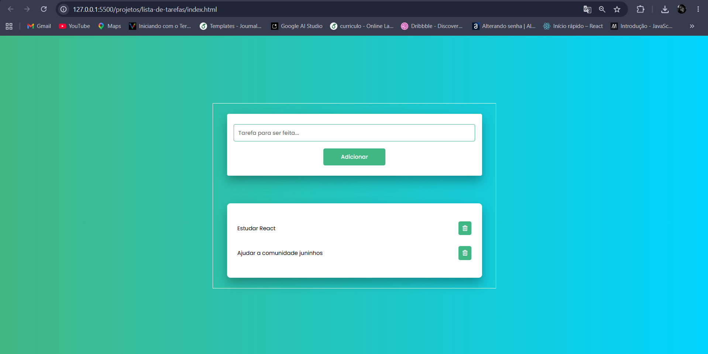

# Lista de tarefas

Aplicação para criar, concluir e remover tarefas. Os dados são salvos no próprio navegador com `localStorage`, por isso continuam disponíveis depois que a página é recarregada.

## Funcionalidades

- Adição de novas tarefas;
- Validação para impedir tarefas vazias;
- Marcação de tarefas como concluídas;
- Exclusão de tarefas;
- Armazenamento automático no navegador;
- Recuperação das tarefas ao abrir a página novamente.

Para concluir ou reabrir uma tarefa, clique no texto dela. Para removê-la, clique no ícone de lixeira.

## Tecnologias

- HTML5;
- CSS3;
- JavaScript;
- `localStorage`;
- Google Fonts;
- Font Awesome.

Google Fonts e Font Awesome são carregados pela internet. Sem conexão, a fonte e o ícone de lixeira podem não aparecer.

## Como executar

1. Baixe ou clone este repositório.
2. Abra a pasta `projetos/lista-de-tarefas`.
3. Abra o arquivo `index.html` no navegador.

Não é necessário instalar dependências.

## Como usar

1. Digite uma tarefa no campo de texto.
2. Clique em **Adicionar**.
3. Clique no texto de uma tarefa para marcá-la como concluída.
4. Clique na lixeira para excluir a tarefa.

Se o botão for pressionado com o campo vazio, o campo será destacado em vermelho.

## Armazenamento dos dados

As tarefas são armazenadas na chave `tasks` do `localStorage`. Os dados ficam somente no navegador e no dispositivo em uso. Limpar os dados do site no navegador também remove as tarefas salvas.

## Estrutura do projeto

```text
lista-de-tarefas/
├── index.html
├── scripts.js
├── styles.css
├── image.png
└── README.md
```

- `index.html`: estrutura da aplicação;
- `styles.css`: aparência da página e estados visuais;
- `scripts.js`: criação, conclusão, exclusão e armazenamento das tarefas;
- `image.png`: captura de tela do projeto.

## Prévia


