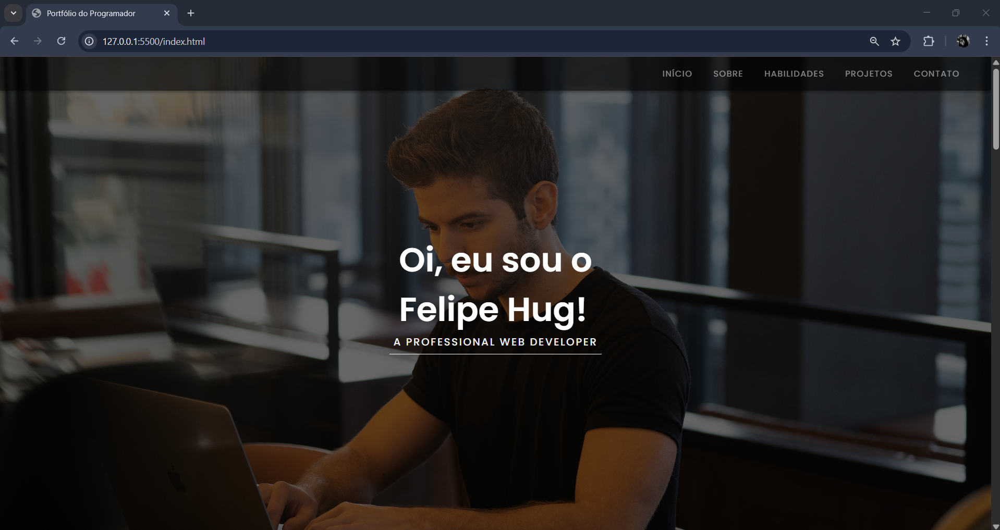

# Portfolio Programador

Landing page de portfólio pessoal com foco em apresentação profissional, habilidades, projetos e contato.

## Sobre o projeto

Este projeto foi desenvolvido como uma página única (one page) para exibir informações de um desenvolvedor web, com as seguintes seções:

- Início (showcase)
- Sobre mim
- Habilidades
- Projetos
- Contato
- Rodapé com redes sociais

## Tecnologias utilizadas

- HTML5
- CSS3
- CSS responsivo com media query em arquivo separado
- Google Fonts (fonte Poppins)

## Estrutura do projeto

```text
portfolio-programador/
├─ index.html
├─ styles.css
├─ mobile.css
├─ image.png
├─ image-1.png
└─ images/
	 ├─ avatar.png
	 ├─ showcase.jpg
	 ├─ html-icon.png
	 ├─ css-icon.png
	 ├─ javascript-icon.png
	 ├─ project-1.jpg
	 ├─ project-2.jpg
	 ├─ project-3.jpg
	 └─ project-4.jpg
```

## Layout e responsividade

- Layout desktop com navegação no topo e seções bem definidas.
- Ajustes para telas menores em `mobile.css` (`@media (max-width: 1024px)`).
- Cards e blocos reorganizados para leitura vertical no mobile.

## Como executar

1. Clone ou baixe o projeto.
2. Abra a pasta no VS Code.
3. Execute o arquivo `index.html` no navegador.

Dica: você pode usar a extensão Live Server para desenvolvimento local com atualização automática.

## Prévia do projeto

### Desktop

<p align="center">
  
</p>

### Mobile

<p align="center">
  
</p>

