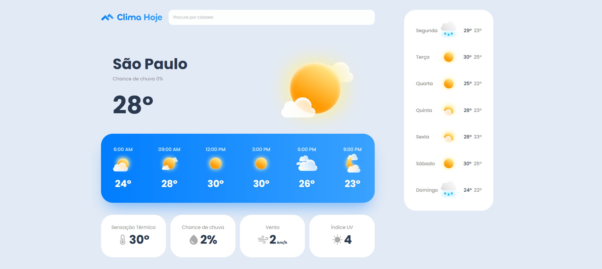
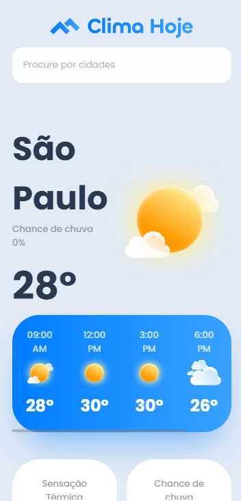

# ☁️ Clima Hoje

Aplicação de previsão do tempo com layout responsivo, exibindo temperatura atual, previsão por hora, previsão semanal e detalhes climáticos como sensação térmica, chance de chuva, vento e índice UV.

## 🖥️ Preview

### Desktop



### Mobile



## 🚀 Tecnologias

- HTML5
- CSS3 (Flexbox, Grid, Media Queries, Transições)
- Google Fonts (Poppins)

## 📁 Estrutura

```
previsao-do-tempo/
├── index.html
├── styles.css
├── mobile.css
└── images/
```

## ✨ Funcionalidades

- Exibição da cidade, temperatura e condição climática atual
- Previsão por hora do dia
- Previsão para os próximos 7 dias
- Cards de detalhes: sensação térmica, chance de chuva, vento e índice UV
- Layout responsivo para mobile
- Animação de hover nos cards de detalhes
